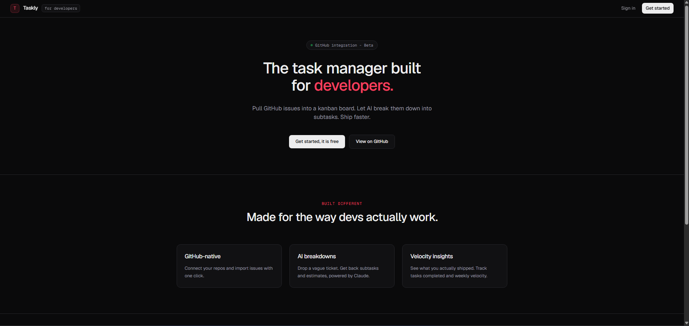
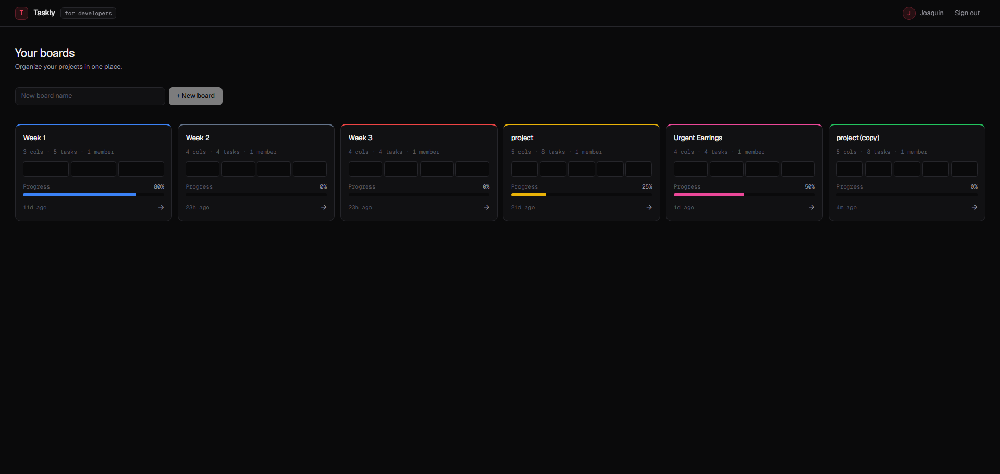
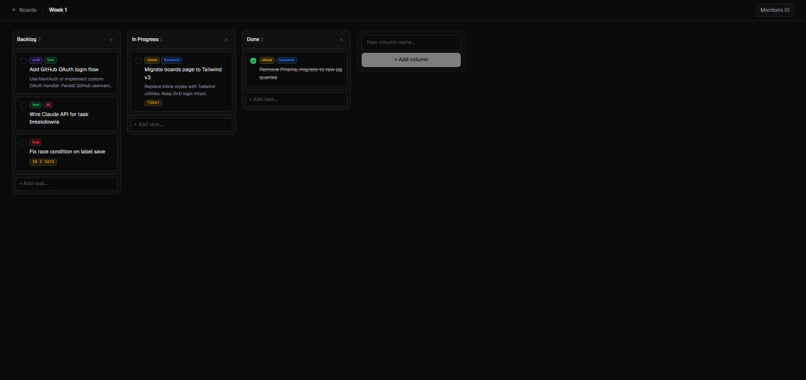
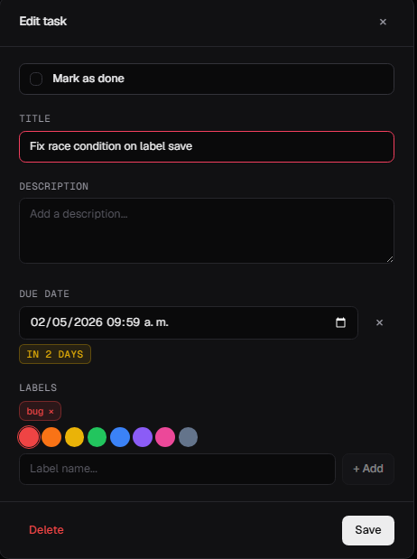

# Taskly

> The task manager built for developers.

A full-stack kanban app with JWT auth, real-time drag and drop, and a dark-first UI inspired by Linear and Vercel. Built as a portfolio project to showcase end-to-end product engineering — from schema design to deploy.

**Live demo:** [taskly-seven-wheat.vercel.app](https://taskly-seven-wheat.vercel.app)

---



## Features

- **JWT authentication** — register, login, persistent sessions
- **Boards, columns and tasks** with native HTML5 drag & drop
- **Color-coded labels** with custom names per task
- **Due dates** with relative status indicators (Overdue, Today, In 2 days)
- **Mark as done** inline from the board or from the task modal
- **Board analytics** — task count, columns, members and live progress bar per board
- **Multi-user collaboration** — invite teammates by email
- **Reorder anything** — boards, columns, tasks, all draggable
- **Dark-first UI** with the Geist typeface and a restrained accent palette



## Stack

| Layer       | Tech                                  |
|-------------|---------------------------------------|
| Frontend    | Next.js 14 (App Router), React 18, Tailwind v3, Geist Sans/Mono |
| Backend     | Node.js 20, Express, raw SQL via `pg` |
| Database    | PostgreSQL 15                         |
| Auth        | JWT in localStorage                   |
| Container   | Docker Compose (db + backend + frontend) |
| Deploy      | Vercel (frontend) + Railway (backend + DB) |

## Architecture

```
┌─────────────────┐         ┌─────────────────┐         ┌─────────────────┐
│  Next.js (web)  │  HTTPS  │  Express (API)  │   SQL   │   PostgreSQL    │
│   Vercel CDN    ├────────►│    Railway      ├────────►│    Railway      │
└─────────────────┘         └─────────────────┘         └─────────────────┘
```

Single-page client talks to a stateless REST API. The API issues JWTs, the client persists them in `localStorage` and sends them as `Authorization: Bearer ...` on every request.



## Technical decisions

A few choices worth highlighting, with the reasoning behind each.

### Raw SQL with `pg` instead of an ORM

Originally built with Prisma. After hitting OpenSSL incompatibilities with Alpine-based Docker images, the entire data layer was rewritten using raw queries through `pg`. The tradeoff: more boilerplate in routes, but full control over SQL, smaller image size, fewer moving parts. For a project this size, an ORM was net negative.

### HTML5 native drag and drop, not a library

The boards list uses CSS Grid for layout. Most popular DnD libraries (`react-beautiful-dnd`, `@hello-pangea/dnd`) don't play well with grid containers. Started with `@hello-pangea/dnd` for the column drag inside boards, then migrated everything to native HTML5 DnD for consistency. The library is gone from `package.json`. Less bundle, fewer dependencies.

### Alpine instead of `node:20`

After removing Prisma, the OpenSSL workaround was no longer needed. Switched the backend image from `node:20` (~400MB) to `node:20-alpine` (~50MB). Faster builds on Railway, cheaper to ship.

### Counts at the API level, not on the client

The boards listing renders cards with stats — number of columns, tasks, completed tasks, members. Could have been done with N+1 client requests. Instead, `GET /boards` does subqueries server-side and returns those counts in the response. One request, no waterfalls.

```sql
SELECT
  b.*,
  (SELECT COUNT(*) FROM columns WHERE board_id = b.id) AS column_count,
  (SELECT COUNT(*) FROM tasks t JOIN columns c ON t.column_id = c.id
                   WHERE c.board_id = b.id) AS task_count,
  (SELECT COUNT(*) FROM tasks t JOIN columns c ON t.column_id = c.id
                   WHERE c.board_id = b.id AND t.done = true) AS done_count,
  (SELECT COUNT(*) FROM board_members WHERE board_id = b.id) AS member_count
FROM boards b ...
```

### Dark-first design system

Tailwind v3 with a custom palette inspired by Linear: near-black backgrounds (`#0A0A0B`, not pure black), restrained accent palette, exponential gray scale for hierarchy. Geist Sans for UI, Geist Mono for technical accents (IDs, tags, metadata). Light mode is on the roadmap.



## Run locally

Requires Docker Desktop.

```bash
git clone https://github.com/joakol119/Taskly.git
cd Taskly
docker compose up --build
```

The app will be available at:
- Frontend: `http://localhost:3000`
- Backend: `http://localhost:4000`

To run only the database and backend (and use `npm run dev` for frontend hot reload):

```bash
docker compose up backend db
cd frontend && npm install && npm run dev
```

### Environment variables

Defaults are provided in `docker-compose.yml` for local development. For production you'll need:

```
DATABASE_URL=postgresql://...
JWT_SECRET=<random-string>
NEXT_PUBLIC_API_URL=<your-backend-url>
```

## Roadmap

- [ ] **GitHub OAuth login** — sign in with GitHub
- [ ] **GitHub issues import** — bring open issues from a repo into a board with one click
- [ ] **AI breakdowns** — break down a vague ticket into subtasks with Claude
- [ ] **Velocity dashboard** — track tasks completed per week, time estimates vs real
- [ ] **Light mode** — full theme support
- [ ] **Backend tests** — Vitest integration tests for auth and CRUD
- [ ] **Email invitations** — actual emails when someone is added to a board

## About

Built by **Joaquín Poblete**, junior full-stack developer based in Montevideo, Uruguay.

- LinkedIn — [linkedin.com/in/joaquin-poblete-esteves](https://www.linkedin.com/in/joaquin-poblete-esteves-315780234/)
- Email — [joaquinpobletesteves@gmail.com](mailto:joaquinpobletesteves@gmail.com)
- GitHub — [@joakol119](https://github.com/joakol119)

Open to junior frontend, backend or full-stack roles.
